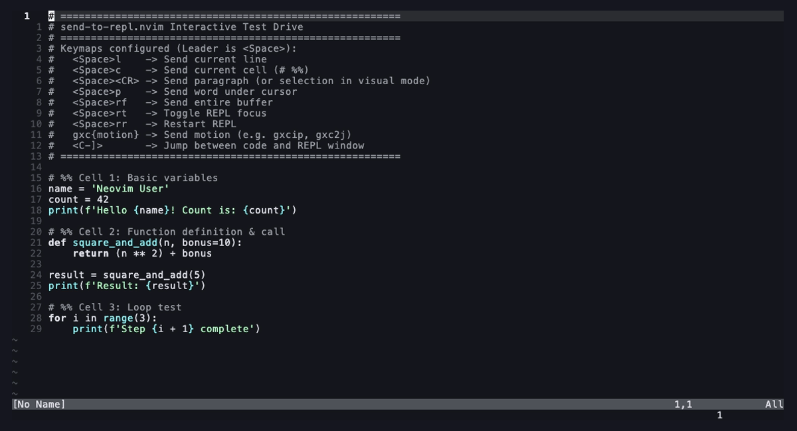

# send-to-repl.nvim

A Neovim plugin for sending code directly to an interactive terminal REPL. Designed for rapid experimentation, data analysis, and iterative script development without needing Tmux or external multiplexers.



## What You Can Do

- **Send Any Code Chunk**: Send the current line, word, paragraph, or visual selection with a single keypress.
- **Run Notebook Cells**: Execute self-contained code cells delimited by `# %%`, `##`, `// %%`, or `-- %%`.
- **Use Vim Motions**: Use native operator motions (e.g. `gxcip` for inner paragraph, `gxcaf` for a function) to send arbitrary text objects, the entire buffer or custom line ranges.
- **Control the REPL**: Toggle window focus, restart the session, send interrupts (`Ctrl-C`), or clear the screen (`Ctrl-L`).
- **Flexible Terminal Layouts**: Open REPLs in vertical splits, horizontal splits, or tabs with customizable split sizes.
- **Ready for Multiple Languages**: Built-in defaults for Python (`uv` + IPython with autoreload), R, Julia, Lua, Bash, Zsh, Node.js, and TypeScript.

---

## Requirements

- Neovim >= 0.10.0 (0.11+ recommended)
- If using Python defaults: [uv](https://github.com/astral-sh/uv) (or configure standard `python3`/`ipython`)

---

## Installation & Setup

### [lazy.nvim](https://github.com/folke/lazy.nvim)

```lua
{
  "toreerdmann/send-to-repl.nvim",
  keys = {
    { "<leader>l", function() require("send-to-repl").send_line() end, desc = "Send line to REPL" },
    { "<leader>p", function() require("send-to-repl").send_word() end, desc = "Send word to REPL" },
    { "<leader>c", function() require("send-to-repl").send_cell() end, desc = "Send cell to REPL" },
    { "<leader><CR>", function() require("send-to-repl").send_paragraph() end, desc = "Send paragraph to REPL" },
    { "<leader><CR>", function() require("send-to-repl").send_visual() end, mode = "v", desc = "Send selection to REPL" },
    { "<leader>rf", function() require("send-to-repl").send_file() end, desc = "Send file to REPL" },
    { "<leader>rt", function() require("send-to-repl").toggle_repl() end, desc = "Toggle REPL window" },
    { "<leader>rr", function() require("send-to-repl").restart_repl() end, desc = "Restart REPL" },
    { "gxc", function() require("send-to-repl").send_operator() end, desc = "Send motion to REPL" },
  },
  opts = {
    layout = {
      split = "vertical", -- "vertical" | "horizontal" | "tab"
      size = 0.4,         -- 40% split width/height
    },
  },
}
```

---

## Configuration

Default options:

```lua
require("send-to-repl").setup({
  layout = {
    split = "vertical", -- "vertical" | "horizontal" | "tab"
    size = nil,         -- nil for default split, or number (e.g. 0.4 for 40% or 80 for cols)
    open = nil,         -- optional custom function: fun(cmd: string): number (term_buf)
  },
  cell_marker = nil,    -- string or table<filetype, pattern> (defaults to `# %%`, `// %%`, etc.)
  bracketed_paste = true,
  wait_for_prompt = true,
  repls = {
    python = {
      cmd = "uv",
      args = { "run", "--with", "ipython", "--", "ipython", "--profile", "nvim" },
      ensure_ipython_profile = true,
    },
    r = { cmd = "R", args = { "--no-save", "--quiet" } },
    julia = { cmd = "julia", args = {} },
    lua = { cmd = "lua", args = {} },
    sh = { cmd = "bash", args = {} },
    bash = { cmd = "bash", args = {} },
    zsh = { cmd = "zsh", args = {} },
    javascript = { cmd = "node", args = {} },
    typescript = { cmd = "ts-node", args = {} },
  },
})
```

### Custom Python / Virtual Environment Example

Commands and arguments can also be functions for dynamic resolution:

```lua
opts = {
  repls = {
    python = {
      cmd = function()
        if vim.fn.filereadable(".venv/bin/python") == 1 then
          return ".venv/bin/python"
        end
        return "python3"
      end,
      args = { "-i" },
      ensure_ipython_profile = false,
    },
  },
}
```

---

## Lua API & User Commands

| Lua API | User Command | Description |
| :--- | :--- | :--- |
| `require("send-to-repl").send_line()` | `:SendToReplLine` | Send line under cursor |
| `require("send-to-repl").send_word()` | `:SendToReplWord` | Send word under cursor |
| `require("send-to-repl").send_paragraph()` | `:SendToReplParagraph` | Send paragraph under cursor |
| `require("send-to-repl").send_visual()` | `:SendToReplVisual` | Send visually selected text |
| `require("send-to-repl").send_cell()` | `:SendToReplCell` | Send code cell (`# %%`, `##`, etc.) |
| `require("send-to-repl").send_file()` | `:SendToReplFile` / `:SendToReplBuffer` | Send entire buffer |
| `require("send-to-repl").send_range(l1, l2)` | — | Send line range `[l1, l2]` |
| `require("send-to-repl").send_operator()` | — | Operator motion function |
| `require("send-to-repl").send(text)` | `:SendToReplSend <text>` | Send arbitrary text |
| `require("send-to-repl").toggle_repl()` | `:SendToReplToggle` | Toggle/Focus REPL window |
| `require("send-to-repl").restart_repl()` | `:SendToReplRestart` | Restart the REPL process |
| `require("send-to-repl").clear()` | `:SendToReplClear` | Send `<C-l>` / clear screen |
| `require("send-to-repl").interrupt()` | `:SendToReplInterrupt` | Send `<C-c>` / SIGINT |

---

## Interactive Test Drive

You can launch a completely isolated, clean Neovim session with pre-configured keymaps and an interactive demo buffer without touching your personal config:

```bash
./scripts/test_drive.sh
```

Or open a specific file:

```bash
./scripts/test_drive.sh path/to/script.py
```

---

## Running Tests

```bash
./scripts/run_tests.sh
```

Or run headless directly:
```bash
XDG_CONFIG_HOME=/tmp XDG_DATA_HOME=/tmp nvim --headless --clean -u tests/minimal_init.lua -c "PlenaryBustedFile tests/tests.lua"
```

